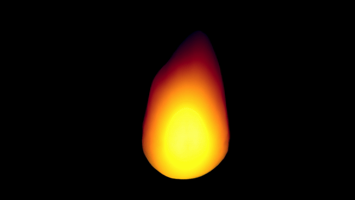
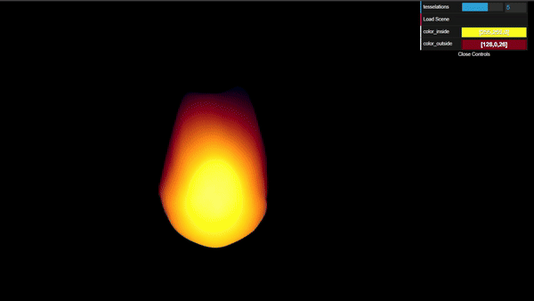

# Project 1: Noise
## Live Demo
 - Also available at [Live demo on webpage](https://cwncwncwn.github.io/CIS566-hw00-intro-base/)

     - 
 - Main colors can be adjusted by GUI, too
     - 

## Project Features
- Custom shaders to construct a fireball with the use of 3D noise functions and time curve.
    - Vertex Shader: causing the deformation of the object.
      - Constructed a (smoothed) mask to filter vertices at the upper part of the sphere and applied low-frequency Perlin noise for basic shape
      - Added more low-frequency Perlin Noise for subtle overall shape deformation over time
      - Constructed a smoother mask to filter vertices on the upper part of the sphere and applied high-frequency FBM noise for more subtle deformation, and that the lower part of the sphere is less influenced by this deformation.
    - Fragment Shader: controlling fragment color of the object. 
      - Constructed differnt layers of colors and blended them together:
        - Layer 1: Used a similar mask as in the vertex shader for a smooth color transition from the upper part of the sphere to the lower part of the sphere.
        - Layer 2: With the light direction vector set from camera to the fireball, use the Lambert diffuse term as the mask to create a color transition from the edge of the sphere to the center of the sphere.
        - Layer 3: Used Lambertion diffuse term to create a mask for the center part of the fireball color.
      - Applied time-based noise (Perlin and FBM) for more interesting variations. 

- GUI
    - Color palatte to adjust the base color of the object.
      - Inner color
      - Outer color
